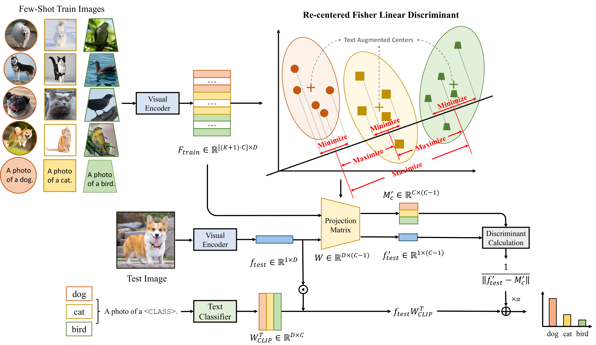
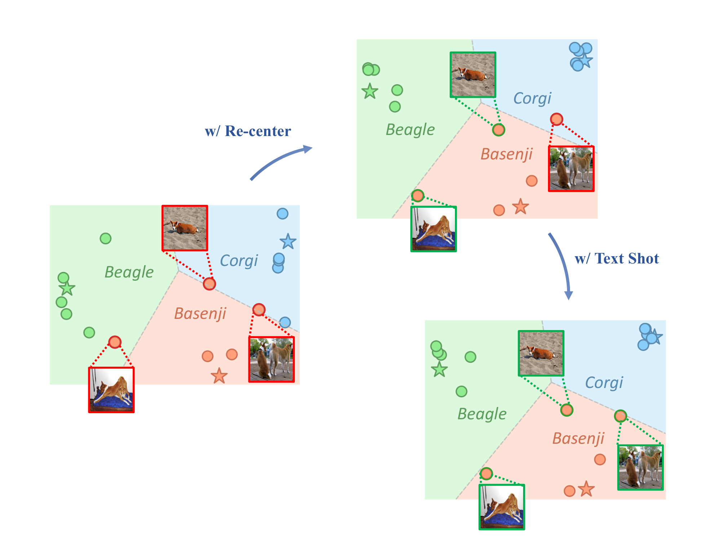

# TARP: Text-Anchored Re-centering Projection for Few-shot CLIP Adaptation

Official implementation of **TARP**, a training-free few-shot adaptation method for CLIP.

<p align="center">
  
</p>

TARP augments CLIP few-shot adaptation at two complementary levels, on top of the CLIP
**text prototype** (`W_clip[c]`, the per-class text classifier row):

1. **Prior-level augmentation — Re-Centered FLD.** A Fisher Linear Discriminant (FLD)
   projection whose between-class scatter is built from class means re-centered toward the
   CLIP text prototypes :

   `m*_c = (N_c / (N_c + tau)) * m_img_c + (tau / (N_c + tau)) * m_txt_c`,  where `m_txt_c = W_clip[c]`.

2. **Data-level augmentation — Text-as-Shot.** The per-class text descriptions
   are encoded by CLIP and appended to the support cache as extra "text shots", enlarging the support set used to compute the FLD.

<p align="center">
  
</p>

## Repository layout

```
TARP/
├── main.py                  # unified entry point (--backbone {RN50,RN101,ViT-B/16,ViT-B/32})
├── utils.py                 # cache IO, class means, text prototypes, accuracy
├── modules/
│   └── fld_base.py          # the re-centered FLD projector (fld_center)
├── clip/                    # local CLIP implementation + BPE tokenizer
├── datasets/                # 11 few-shot dataset readers
├── configs/                 # <dataset>/<shot>.yaml (11 datasets x 5 shots)
├── scripts/                 # download_caches.sh, run_all.sh
├── assets/                  # pipeline and instance figures
└── caches/                  # precomputed feature caches (empty here; see below)
```

## Installation

```bash
# Option A: conda
conda env create -f environment.yml
conda activate tarp

# Option B: pip
pip install -r requirements.txt
```

CLIP model weights (RN50/RN101/ViT-B-16/ViT-B-32) are downloaded automatically on first use
to `~/.cache/clip`.

## Data

Please follow [Tip-Adapter's DATASET.md](https://github.com/gaopengcuhk/Tip-Adapter/blob/main/DATASET.md)
to download and prepare the datasets, then point the configs at the prepared roots via the
environment variables `DATASET_ROOT` (the standard few-shot datasets) and `DATASET_IMAGENET`
(ImageNet).

## Precomputed caches

`caches/` ships **empty** in this repo. The precomputed image feature caches
(~22 GB, fp16) let you reproduce all results without a GPU forward pass over the data.

They are shared as a public Google Drive folder:
<https://drive.google.com/drive/folders/1YgExR-xJdEqVf3u43hhGiiqFe9I57gHm>

Download them into `caches/` with:

```bash
bash scripts/download_caches.sh   # uses gdown, downloads the folder into ./caches/
```

Layout: `caches/{rn50,rn101,vitb16,vitb32}/{seed1,seed2,seed3}/<dataset>/`.
Each dataset folder holds `seed{S}_clip_{keys,values}_{1,2,4,8,16}shots.pt` and
`seed{S}_{val,test}_clip_{f,l}.pt`.

To **recompute** caches instead of downloading, set `load_cache: false` and
`load_pre_feat: false` in the config; they will be written to the same location.

## Run

```bash
# Single run: <dataset> <shot> <backbone> <seed>
python main.py --config configs/eurosat/16shot.yaml --backbone RN50 --seed 1

# ImageNet on ViT-B/16
python main.py --config configs/imagenet/16shot.yaml --backbone ViT-B/16 --seed 1
```

Results (config, log, `results.json`) are written to
`results/<backbone>/<dataset>/<shot>shot/<exp_name>_<timestamp>/`.

To reproduce the full main table (4 backbones x 11 datasets x 3 seeds x 16-shot):

```bash
bash scripts/run_all.sh
```
